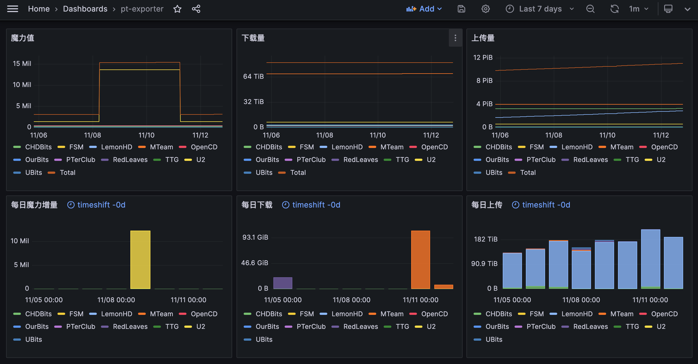

# pt-exporter

pt-exporter 是一个基于 [pt-crawler](https://github.com/zqmillet/pt-crawler) 开发的 Private Tracker 站点的 Prometheus 监控代理, 主要用于收集你自己 PT 站点的个人信息, 包括上传, 下载, 魔力值等信息. 免去了自己手动同步 PTPP 的烦恼.

配合 Grafana 可以实现很好的 PT 数据可视化.



## 安装

pt-exporter 提供了两种安装方式, 一种是 PyPI 安装, 一种是 Docker 安装. 如果你是 Windows 操作系统或者有 Python 环境, 推荐使用 PyPI 安装方式; 如果你有 Docker 环境推荐使用 Docker 安装.

### PyPI 安装

``` bash
$ pip3 install pt-exporter
```

或者

``` bash
$ python3 -m pip install pt-exporter
```

安装后, 系统中会多出一个 `pt-exporter` 的命令, 你可以在控制台中使用 `pt-exporter -v` 命令显示版本号, 如果能正常打印版本号, 则表示您已经成功安装 pt-exporter.

``` bash
$ pt-exporter -v
1.0.5
```

### Docker 安装

``` bash
docker pull zqmillet/pt-exporter
```

安装后可以通过 `docker run -it pt-exporter:latest pt-exporter -v` 显示版本号, 如果能正常打印版本号, 则表示您已经成功安装 pt-exporter.

``` bash
$ docker run -it pt-exporter:latest pt-exporter -v
1.0.5
```

## 配置文件

在使用 pt-exporter 之前, 需要编写 pt-exporter 的配置文件, 您不用担心, 配置文件非常简单. 值得注意的是, pt-exporter 使用的是 YAML 作为配置文件语言, 您需要格外注意配置文件的缩进, 因为缩进会改变配置文件的层次结构.

如下所示, 是一个 pt-exporter 的配置文件的样例.

``` yaml
crawlers:
  - website: MTeam
    headers:
      authorization: <mteam-authorization>
    timeout: 5
  - website: CHDBits
    headers:
      cookie: <chdbits-cookie>
    proxy: http://<host>:<port>
    base-url: https://abc.chdbits.xyz
```

其中 ``crawlers`` 字段是一个列表, 其中包含两个爬虫配置:

- 第一个爬虫爬取的网站是 MTeam, 请求头包含 `authorization` 字段, 超时时间为 5 秒.
- 第二个爬虫爬取的网站是 CHDBits, 请求头包含 `cookie` 字段, 使用代理 `http://<host>:<port>` 进行访问此站, 并重置网站域名为 `https://abc.chdbits.xyz`.

因为 pt-exporter 是基于 pt-crawler 开发的, 因此 pt-exporter 暂时只支持 pt-crawler 支持的 PT 站, 如果希望支持更多的 PT 站点, 请给 [pt-crawler](https://github.com/zqmillet/pt-crawler) 提 issue.

不同网站所需请求头中的字段是不同的, 下表为每个 PT 站所必需字段.

| 别称   | 类                   | `.header` 中必需字段   |
|--------|----------------------|------------------------|
| 岛     | `crawlers.CHDBits`   | `cookie`               |
| 馒头   | `crawlers.MTeam`     | `authorization`        |
| 拉面   | `crawlers.FSM`       | `apitoken`             |
| 套套   | `crawlers.TTG`       | `cookie`               |
| 猫站   | `crawlers.PTerClub`  | `cookie`               |
| 红叶   | `crawlers.RedLeaves` | `cookie`               |
| 皇后   | `crawlers.OpenCD`    | `cookie`               |
| 我堡   | `crawlers.OurBits`   | `cookie`               |
| 你堡   | `crawlers.UBits`     | `cookie`, `user-agent` |
| 幼儿园 | `crawlers.U2`        | `cookie`               |
| 柠檬   | `crawlers.LemonHD`   | `cookie`, `user-agent` |

其中 `cookie` 和 `authorization` 可以在浏览器中获取, 其中获取方式详见[此链接](https://blog.csdn.net/qq_39915672/article/details/104136634), 拉面的 `apitoken` 需要在网站自行生成, 有效期为一个月.

在配置文件中, 只有 `website` 和 `headers` 这两个字段是必需的, 其他参数均为可选.

## 启动服务

### PyPI 安装

如果您是使用 PyPI 安装使用如下命令启动服务.

``` bash
$ pt-exporter -c /path/of/config.yaml -p 8000
2024-10-28 20:54:48.687 | INFO     | pt_exporter.crawlers:get_users:40 - get user from MTeam successfully
2024-10-28 20:54:49.415 | INFO     | pt_exporter.crawlers:get_users:40 - get user from CHDBits successfully
INFO:     Started server process [81951]
INFO:     Waiting for application startup.
INFO:     Application startup complete.
INFO:     Uvicorn running on http://0.0.0.0:8000 (Press CTRL+C to quit)
```

上述命令会加载配置文件 `/path/of/config.yaml` 并启动服务, 监听 8000 端口. 如果没有异常日志, 则表示服务正常.

### Docker 安装

如果您是使用 Docker 安装, 请将配置文件重命名为 `.pt-exporter.yaml`, `.pt-exporter` 所在的目录记为 `<directory-of-config>`, 使用如下命令启动服务.

``` bash
$ docker run -itd -p 8000:8000 -v <directory-of-config>:/root pt-exporter:latest pt-exporter
2890250d702e94c785d62a9c44dbaca608bf830f79d9ce0988992f54f581850a

$ docker logs 2890250d702e94c785d62a9c44dbaca608bf830f79d9ce0988992f54f581850a
2024-11-14 14:04:14.821 | INFO     | pt_exporter.crawlers:get_users:40 - get user from CHDBits successfully
2024-11-14 14:04:18.070 | INFO     | pt_exporter.crawlers:get_users:40 - get user from PTerClub successfully
INFO:     Started server process [1]
INFO:     Waiting for application startup.
INFO:     Application startup complete.
INFO:     Uvicorn running on http://0.0.0.0:8000 (Press CTRL+C to quit)
```

上述命令会加载配置文件并启动服务, 通过 `docker logs` 查看日志, 如果没有异常日志, 则表示服务正常.

### 验证服务

可以使用 `curl` 命令来判断 pt-exporter 是否正常运行, 如果出现类似以下响应数据, 则表示服务正常.

``` bash
$ curl http://localhost:8000/metrics
# HELP upload_bytes upload bytes of website
# TYPE upload_bytes gauge
upload_bytes{website="MTeam"} 4.463126014388356e+015
upload_bytes{website="CHDBits"} 3.601753801989554e+015
# HELP download_bytes download bytes of website
# TYPE download_bytes gauge
download_bytes{website="MTeam"} 7.4603744149538e+013
download_bytes{website="CHDBits"} 2.546468929929e+012
# HELP bonus download bytes of website
# TYPE bonus gauge
bonus{website="MTeam"} 362265.7
bonus{website="CHDBits"} 266830.5
```

## 配置 Prometheus

在 Prometheus 的配置文件中的 `scrape_configs` 添加一项 `pt-exporter`.
``` yaml
scrape_configs:
  - job_name: "pt-exporter"
    static_configs:
      - targets: ["<host>:<port>"]
```

其中:

- `<host>` 是你启动 pt-exporter 的服务器地址.
- `<port>` 是你启动 pt-exporter 的服务端口.

重启 Prometheus 服务即可生效.

## Grafana 配置

待补充

# TODO

- 支持时魔采集.
- 支持保种数量/体积采集.
